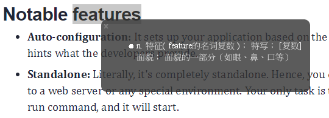
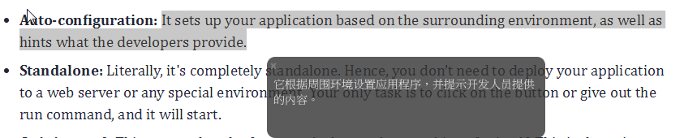

## [介绍](#introduce)
CC Translate 是一个用java语言编的简单便捷翻译工具，通过调用Google Translate API 进行在线翻译。

## [如何使用](#howto)
使用者只需要 选中需要翻译的词语或者句子，按两下ctrl + c 即可实现翻译。

- 翻译单词

- 翻译句子

## [下载](#download)
点击下面的连接下载

## [安装](#install)